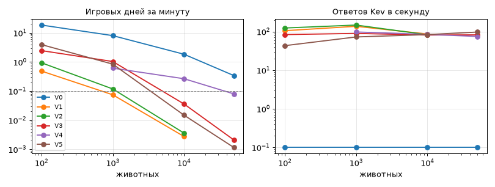
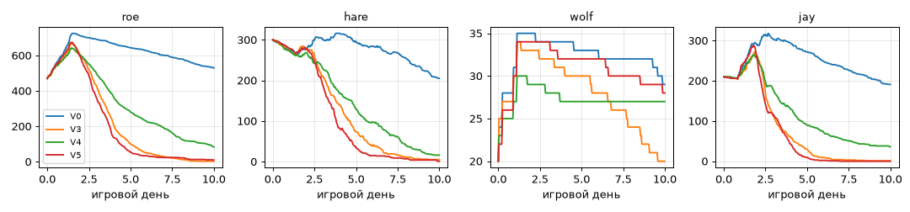

# Результаты: лесная экосистема с решениями Kev

План и гипотезы — [kev-ecosystem.md](kev-ecosystem.md). Сырые данные — `sim/out/` (не в git).

## E0. Скорость Kev-0.8B на RTX 5070 Ti

Условия: сервер `kev.serve` из `~/ml/kev` в Ubuntu 24.04 (WSL2), bf16, CUDA graphs включены, пакета `fla` (быстрые ядра линейного внимания Qwen3.5) нет. Замер — `sim/ecosystem/eco/bench.py`: у каждого запроса свой случайный state косули, поэтому кэш префикса почти не срабатывает, как и в симуляции. «С дороги» — время HTTP-запроса из Python в WSL, «модель» — `latency_ms` сервера. 28.09.2026.

### Без игры

| Одновременно | State, токенов | Вопросов | Запросов/с | Модель p50/p95, мс | С дороги p50/p95/p99, мс | Позже 0,3 с |
|---|---|---|---|---|---|---|
| 1 | 100 | 1 | 29 | 23 / 42 | 25 / 86 / 103 | 0% |
| 1 | 200 | 3 | 27 | 34 / 35 | 37 / 38 / 38 | 0% |
| 1 | 400 | 6 | 15 | 61 / 69 | 64 / 73 / 129 | 0% |
| 8 | 100 | 1 | 40 | 139 / 168 | 209 / 215 / 215 | 2% |
| 8 | 200 | 3 | 37 | 180 / 181 | 217 / 222 / 223 | 0% |
| 8 | 400 | 6 | 18 | 379 / 390 | 454 / 472 / 473 | 98% |
| 16 | 200 | 3 | 39 | 368 / 368 | 404 / 416 / 419 | 99% |
| 64 | 100 | 1 | 74 | 627 / 807 | 837 / 1025 / 1609 | 94% |
| 64 | 200 | 3 | 41 | 1007 / 1028 | 1556 / 1607 / 1611 | 100% |
| 64 | 400 | 6 | 21 | 2131 / 2162 | 3046 / 3133 / 3146 | 100% |

Полная сетка 1/8/32/64 × 100/200/400 × 1/3/6 — `sim/out/e0_base.json`, выборочно перемерено на пустом GPU — `e0_clean.json`.

- **Батчинг почти не помогает.** Время модели растёт с размером батча линейно: 8 запросов — 180 мс, 16 — 368 мс, 64 — ~1 с (200 токенов, 3 вопроса). GPU загружен на 96–99%: сервер упирается в вычисления, ~10 тыс. токенов в секунду. Потолок — **~40 запросов/с** при state 200 токенов и 3 вопросах, **~75 запросов/с** при 100 токенах и 1 вопросе.
- **Цена — токены.** Пропускная способность почти обратно пропорциональна длине запроса: 100 токенов вдвое дешевле 400, каждый вопрос добавляет ~10–20%.
- **Задержка.** Один запрос — 25–65 мс, быстрее реакции живого зверя. Очередь из 8 запросов — уже 200 мс с дороги; дальше ответ опаздывает к сроку 0,3 с почти всегда.
- **Видеопамять.** В покое сервер занимает ~5 ГБ, после батчей по 64 длинных запроса — 13,8 ГБ, и PyTorch её не отдаёт.

### С запущенной игрой

Сцена мира в окне 1920×1080 (vsync, 144 Гц) и нагрузка на Kev одновременно:

| Одновременно | State | Вопросов | Запросов/с без игры → с игрой | Модель p50, мс без игры → с игрой |
|---|---|---|---|---|
| 1 | 200 | 3 | 27 → 19–24 | 34 → 37–49 |
| 8 | 200 | 3 | 37 → 26 | 180 → 253 |
| 64 | 200 | 3 | 41 → 30 | 1007 → 1556 |
| 64 | 100 | 1 | 74 → 54 | 627 → 693 |

- **Игра не проседает:** все 37 секунд нагрузки держала 144 FPS (предел vsync).
- **Kev теряет 25–30% пропускной способности** — GPU отдаёт приоритет графике.
- **Видеопамять почти вся:** 14,7 из 16 ГБ. Тяжёлой сцене или второму процессу места нет.

### Проверка H1

| Критерий E0 | Результат |
|---|---|
| p95 ≤ 50 мс при 8 запросах | **Нет:** 164–390 мс модели, 215–470 мс с дороги |
| Видеопамять ≤ 4 ГБ | **Нет:** 5 ГБ в покое, до 13,8 ГБ под нагрузкой |
| Игра не ниже 60 FPS | **Да:** 144 FPS |

H1 выполняется только для одиночных запросов (25–65 мс). Бюджет всей экосистемы — **~30–75 решений Kev в секунду** на всю видеокарту (с игрой — нижняя граница). При реакции к сроку 0,3 с одновременно в очереди должно быть не больше ~8 коротких запросов. Отсюда: спрашивать Kev о каждом шаге каждого животного нельзя, нужны V2–V5 — решения на группу, кэш, внимание по расстоянию, личная политика.

### С быстрыми ядрами `fla`

Решение Сергея: поставить быстрые ядра по рецепту Kev (`modal_app.py`) в venv `~/ml/kev` через `uv pip`:
- `flash-linear-attention==0.5.2` (+ `fla-core`, `einops`);
- triton 3.4.0 → 3.8.0;
- `causal-conv1d` 1.7.0, готовое колесо под cu12/torch 2.8/cp313, `--no-deps`.

`kev.checkpoint.fused_available()` = True, sm_120 работает. Версии до установки — `~/ml/kev_freeze_before.txt`; откат — `uv sync --extra serve` в `~/ml/kev` (вернёт lock). Сервер теперь запускается напрямую из venv (`~/ml/kev_restart.sh`), не через `uv run`: тот синхронизировал бы окружение с lock и вернул triton 3.4.

| Нагрузка | Запросов/с до → после | Модель p50/p95, мс до → после | С дороги p95, мс до → после | Позже 0,3 с до → после |
|---|---|---|---|---|
| 1 × (100 ток, 1 вопр) | 29 → 50 | 23/42 → 10/29 | 86 → 52 | 0 → 0 |
| 1 × (200, 3) | 27 → 48 | 34/35 → 16/23 | 38 → 27 | 0 → 0 |
| 1 × (400, 6) | 15 → 31 | 61/69 → 27/29 | 73 → 33 | 0 → 0 |
| 8 × (200, 3) | 37 → 51 | 180/181 → 95/109 | 222 → 186 | 0 → 0 |
| 8 × (400, 6) | 18 → 36 | 379/390 → 168/172 | 472 → 245 | 98% → 2% |
| 16 × (200, 3) | 39 → 82 | 368/368 → 111/173 | 416 → 261 | 99% → 0 |
| 32 × (200, 3) | 39 → 82 | 586/792 → 210/345 | 1302 → 626 | 99% → 88% |
| 64 × (100, 1) | 74 → 166 | 627/807 → 224/306 | 1025 → 451 | 94% → 94% |
| 64 × (200, 3) | 41 → 91 | 1007/1028 → 446/449 | 1607 → 814 | 100% → 99% |
| 64 × (400, 6) | 21 → 45 | 2131/2162 → 887/1311 | 3133 → 1979 | 100% → 98% |

Видеопамять под нагрузкой: 13,8 → 10,4 ГБ. Полные данные — `sim/out/e0_fla.json`.

Рядом с игрой (vsync 144 Гц): игра держит 143–144 FPS; Kev даёт 47 запросов/с при одиночных запросах, **~65 запросов/с** при 8–64 одновременных (200 токенов, 3 вопроса) и **~127** при 100 токенах и 1 вопросе; 8 одновременных — p95 модели 124 мс, с дороги 167 мс, опозданий нет; видеопамять — 11,2 ГБ.

**Итог E0 после `fla`:**
- Потолок вырос в 2–2,3 раза: **~90 решений-запросов/с** (200 токенов, 3 вопроса), **~165** (100 токенов, 1 вопрос); с игрой — ~65 и ~127.
- Одиночный запрос — 10–27 мс модели.
- Реакция к сроку 0,3 с укладывается при очереди до ~16 запросов.
- H1 по-прежнему не выполнен формально: p95 при 8 запросах — 74–172 мс, а не ≤ 50. Видеопамять — 10,4 ГБ, а не ≤ 4 (ограничение отложено по решению Сергея).

Видеопамять пока не ограничиваем — решение Сергея: вернёмся к этому при связке с игрой (`PYTORCH_CUDA_ALLOC_CONF` или меньший максимальный батч сервера).

## E1. Формат запроса и резкость решений

Вопрос Сани: почти максимальная энтропия и одинаковые решения смелых и трусливых особей в первом прогоне V1 — свойство модели или формата запроса? `sim/ecosystem/eco/formats.py`: 14 явных ситуаций с очевидным ответом (голодная косуля у травы — пастись, волк в 10 м бежит к ней — бежать, жажда 0,95 у воды — пить, ночь и усталость — отдыхать; то же для зайца, волка, сойки), каждая для смелой и трусливой особи, в 18 форматах:
- state: плотный YAML с числами / короткие английские фразы / числа со словесными ярлыками;
- instructions: пусто / роль «You decide what this wild {animal} does next, as a real animal would»;
- criteria: только имена / описания, как в симуляции / «когда уместно».

Меры: совпадение argmax с ожидаемым, средняя вероятность ожидаемого, средняя энтропия, JS между смелой и трусливой. Данные — `sim/out/e1.json`; пересчёт с заострением — `eco/sharpen.py`.

Сервер Kev отдаёт распределения при температуре 2,35 (калибровка, видна в `/v1/models`), поэтому они плоские даже при верном argmax. Заострение на клиенте `p^α` с нормировкой при α = 2,35 снимает эту температуру.

| Формат | Совпадение | p(ожидаемого) | Энтропия, бит | JS смелая/трусливая |
|---|---|---|---|---|
| YAML, без роли, описания — как было в V1 | 0,79 | 0,29 | 2,58 | 0,0001 |
| Ярлыки, роль, описания — лучший argmax | 0,93 | 0,31 | 2,58 | 0,0007 |
| Фразы, без роли, имена | 0,82 | 0,43 | 2,17 | 0,023 |
| Фразы, роль, описания | 0,82 | 0,41 | 2,32 | 0,020 |
| Фразы, роль, описания, α = 2,35 — **выбран** | 0,82 | **0,66** | **1,37** | **0,071** |
| Фразы, роль, имена, α = 4 | 0,61 | 0,61 | 0,84 | 0,198 |

- **Равномерность была в основном из-за формата и температуры, а не модели.** Argmax верен в 80–93% явных случаев во всех форматах с описаниями вариантов, но плотный YAML и ярлыки дают плоские распределения и почти не различают характеры.
- **Фразы по-английски — главный рычаг** для характера: JS смелой и трусливой в 20–200 раз больше, чем у YAML и ярлыков.
- **Снятие температуры** поднимает вероятность очевидного ответа с 0,4 до 0,66 и втрое усиливает различие характеров, не меняя argmax.
- Сильнее заострять (α = 4) — резче и характернее, но чаще ошибается там, где модель не уверена; оставляем α = 2,35.

V1–V5 переведены на этот формат (`eco/decide.py`: `state_text` — фразы, роль у вопросов паттерна и реакции, `KevOracle` заостряет `choice` и `noul`). Прогоны масштаба и реального времени идут уже в нём.

## E3–E4. Варианты, масштаб, реальное время

Симуляция — [kev-ecosystem-sim.md](kev-ecosystem-sim.md); серии — `sim/ecosystem/sweep.sh scale|realtime`, сводка — `eco/summary.py`. Базовые виды (косуля, заяц, волк, сойка), seed 1, Kev с `fla`, формат запроса из E1. Сутки — 600 с, поэтому реальное время — 0,1 игрового дня за минуту. Варианты:
- **V0** — ручная логика (utility);
- **V1** — каждое животное спрашивает Kev о паттерне и реакции;
- **V2** — вожак решает за группу, остальные спрашивают только при угрозе;
- **V3** — кэш по огрублённому state;
- **V4** — внимание по расстоянию до камеры: рядом Kev часто, дальше реже, вдали — кэш или V0;
- **V5** — Kev изредка выдаёт особи личную политику на 4 ситуации, между обновлениями она семплирует из неё.

### Ускоренно, батчами (такт ждёт ответы)

| Животных | V0 | V1 | V2 | V3 | V4 | V5 |
|---|---|---|---|---|---|---|
| 100 | 18,6 | 0,49 | 0,94 | 2,5 | — | 4,0 |
| 1 000 | 8,0 | 0,075 | 0,12 | 1,0 | 0,62 | 0,84 |
| 10 000 | 1,8 | 0,003 | 0,004 | 0,036 | 0,27 | 0,015 |
| 50 000 | 0,34 | — | — | 0,002 | 0,08 | 0,001 |

Игровых дней за минуту стены.
- **Kev отдаёт 80–150 запросов/с** при 2–4 вопросах в запросе, видеопамять — 10,7 ГБ. Это и есть бюджет всех вариантов.
- **Спрос на решения** — ~0,15–0,3 в секунду симуляции на животное: 100 животных — 16–24 решения/с, 1 000 — 115–180, 10 000 — 1 200–3 100, 50 000 — 8 000–15 000. V1/V2 упираются в Kev уже на 1 000.
- **V3, кэш:** 75–94% попаданий. Это даёт выигрыш на порядок на 100–1 000 животных, но на 10 000+ ключей слишком много.
- **V4, внимание:** единственный вариант с Kev, который масштабируется. На 10 000 животных — 571 запрос к Kev за прогон; 60% дальних решений из кэша, треть — по V0; 0,27 дня/мин, это в 2,7 раза быстрее реального времени.
- **V5, политика:** один запрос политики — 4 вопроса на длинный state, 550 мс модели в батче. Выгоден, только пока политики обновляются редко. На старте все особи просят политику разом, и прогон упирается в Kev.

### Реальное время (ответ применяется, когда пришёл; реакция позже 0,3 с сим. времени — опоздала)

| Прогон | Решений/с | Отправлено в Kev/с* | С дороги p50/p95, мс | Опоздало реакций |
|---|---|---|---|---|
| V1, 100 | 22 | 22 | 55 / 295 | 0% |
| V1, 500 | 87 | 87 | 262 / 5 205 | 49% |
| V1, 1 000 | 107 | 104 | 1 757 / 6 539 | 100% |
| V2, 1 000 | 129 | 94 | 690 / 5 817 | 83% |
| V3, 1 000 | 135 | 41 | 1 462 / 5 939 | 90% |
| V4, 1 000 | 105 | 30 | 650 / 2 760 | 66% |
| V4, 10 000 | 1 573 | 51 | 943 / 1 786 | 77% |
| V5, 1 000 | 130 | 34 | 2 166 / 2 247 | 39% |
| Всплеск: 5 волков к 20 косулям, V1, 125 | 53 | 53 | 219 / 770 | 49% |
| Всплеск, V2, 125 | 56 | 49 | 204 / 725 | 46% |
| Всплеск, V4, 1 025 | 305 | 120 | 1 149 / 2 684 | 98% |
| Всплеск, V5, 1 025 | 299 | 167 (отвечено ~96) | 2 172 / 2 486 | 71% |

* Отправлено, а не отвечено: запросы, оставшиеся без ответа к концу прогона, отменяются. Потолок ответов Kev — 80–165 в секунду. Особенно заметно у V5: на старте все особи разом просят личную политику. На 10 000 животных за 12,5 с ушло 10 022 запроса, ответ пришёл на 930 (~74/с), остальные отменены; ошибок соединения нет. Со следующих прогонов отчёт считает и ответы (`decisions.oracle_answers`, `answers_per_wall_s`), сводка `eco/summary.py` строит по ним график «Ответов Kev в секунду».
- **V1 в реальном времени — до ~100–300 животных.** На 500 опаздывает половина реакций.
- **Реакции опаздывают даже там, где Kev не перегружен** (V4 на 10 000: 51 запрос/с к Kev, а опоздало 77%). Реакция встаёт в общую очередь клиента за паттернами и политиками, и длинные запросы задерживают короткие. Приоритета реакций нет — это главный недостаток архитектуры.
- **Всплеск:** стая у 20 косуль даёт пачку реакций одновременно, и при 125 животных опаздывает половина. Реакцию на близкого хищника должна решать механика (рефлекс), Kev — только если успевает.

### Разнообразие

| Вариант | Энтропия выбора паттерна, бит (1k батчами) | JS смелая/трусливая, бит (1k) |
|---|---|---|
| V0 | 2,08 | 0,019 |
| V1 | 2,08 | **0,053** |
| V2 | 1,99 | 0,015 |
| V3 | 1,40 | 0,027 |
| V4 | 2,04 | **0,108** |
| V5 | 0,98 | 0,008 |

- **Характер сильнее всего проявляется у V1 и V4** — там, где Kev видит state конкретной особи: в 3–6 раз сильнее, чем у ручной логики.
- **V3 и V5 делают поведение беднее:** кэш и политика усредняют особей. У V5 энтропия вдвое ниже V0 — выбор становится почти однообразным.
- Энтропия V0 и Kev-вариантов сопоставима: живость Kev — не в случайности, а в том, что выбор зависит от особи.

### V6: внимание с приоритетом реакций и сроком

Недостаток V1–V5 — общая очередь, поэтому добавлен **V6**: V4 плюс планировщик.
- Реакции уходят в Kev сразу.
- Паттернов в Kev одновременно не больше 12, остальные ждут.
- Реакция без ответа за 0,3 с симуляции решается по V0; поздний ответ Kev идёт только в кэш.

Серия `sweep.sh v6`, реальное время:

| Прогон | Решений/с | К Kev/с | Опоздало ответов Kev | Реакций: Kev вовремя / V0 по сроку |
|---|---|---|---|---|
| V6, 1 000 | 118 | 34 | 0% (у V4 — 66%) | 176 / 302 |
| V6, 10 000 | 1 584 | 48 | 0% (у V4 — 77%) | 87 / 183 |
| Всплеск, V6, 150 | 59 | 49 | 0% (у V1 — 49%) | 37 / 136 |
| Всплеск, V6, 1 050 | 343 | 106 | 27% (у V4 — 98%) | 98 / 322 |

Остальные реакции закрыты кэшем или V0 по дальности.
- **Приоритет и срок убирают опоздания.** Животное всегда реагирует вовремя; Kev успевает примерно к трети реакций, на остальные отвечает механика.
- **Во всплеске Kev решает меньшинство реакций** (98 из 420): стая даёт пачку одновременных вопросов, и их быстрее закрывает рефлекс/V0. Рядом с камерой при обычной жизни Kev успевает.

## E5. Динамика экосистемы

Серия `sweep.sh dynamics` (+ `dynamics_rest`), батчами. Сравнение: 1 000 животных на 10 игровых дней (V0, V3, V4, V5) и 300 животных на 3 дня (V0, V1, V2). Сводка — `eco/popplot.py`.

| Прогон | Косуля: старт→итог (мин–макс) | Заяц | Волк | Сойка | Удачных охот волка | Смертей: хищники / голод и жажда / прочее | Групп, размер | Смен вожака |
|---|---|---|---|---|---|---|---|---|
| V0 (1 000, 10 дн.) | 470→529 (470–725) | 300→205 | 20→29 | 210→191 | 29% | 280 / 35 / 367 | 107, 4,8 | 83 |
| V3 (1 000, 10 дн.) | 470→3 | 300→5 | 20→20 | 210→1 | 29% | 512 / 750 / 164 | 45, 3,6 | 416 |
| V4 (1 000, 10 дн.) | 470→83 | 300→16 | 20→27 | 210→36 | 33% | 534 / 554 / 221 | 61, 4,2 | 469 |
| V5 (1 000, 10 дн.) | 470→10 | 300→1 | 20→28 | 210→0 | 42% | 666 / 680 / 138 | 45, 3,5 | 97 |
| V0 (300, 3 дн.) | 141→214 | 90→91 | 6→6 | 63→98 | 36% | 20 / 8 / 30 | 36, 4,9 | 8 |
| V1 (300, 3 дн.) | 141→188 | 90→80 | 6→6 | 63→52 | 27% | 52 / 34 / 22 | 31, 4,8 | 98 |
| V2 (300, 3 дн.) | 141→167 | 90→87 | 6→4 | 63→54 | 25% | 29 / 70 / 28 | 33, 5,0 | 7 |

Доли выбранных паттернов (косуля / заяц за прогон):

| Прогон | Пастись | Пить | Отдыхать | Следовать | Бежать | Разведывать |
|---|---|---|---|---|---|---|
| V0, 1 000 | 26% / 15% | 18% / 24% | 29% / 44% | 22% / 8% | 1% / 2% | 4% / 5% |
| V4, 1 000 | 19% / 12% | 40% / 39% | 11% / 12% | 5% / 2% | 17% / 24% | 6% / 9% |
| V5, 1 000 | 17% / 11% | 25% / 17% | 9% / 11% | 2% / 1% | 27% / 35% | 19% / 24% |
| V1, 300 | 30% / 21% | 29% / 28% | 11% / 14% | 7% / 3% | 12% / 19% | 9% / 12% |

- **С Kev без дообучения травоядные вымирают за 5–10 игровых дней.** Смертей от голода и жажды в 15–20 раз больше, чем у V0, от хищников — вдвое больше.
- **Причина видна в выборах.** Kev выбирает «бежать» в 12–35% решений, хотя угрозы чаще всего нет (у V0 — 1–2%). Животные мало отдыхают и почти не держатся группы. Бег тратит силы, одиночку легче поймать, а на еду времени не остаётся.
- **Медленнее всех вымирает V4:** две трети дальних решений в нём принимает V0.
- **Волки держатся:** добычи хватает, пока она есть.
- **Лидерство живее:** смен вожака у V3/V4 в 5–6 раз больше, чем у V0, — Kev чаще соглашается бросить вызов.
- **Разнообразие поведения** на длинных прогонах: энтропия выбора у Kev-вариантов 2,2–2,4 бит против 2,05 у V0; различие характеров (JS) у V3/V4 — 0,04–0,07 против 0,01 у V0.

## Выводы

**Где Kev даёт живость.**
- Выбор зависит от особи. В одной ситуации смелая и трусливая косуля ведут себя по-разному, в 3–7 раз сильнее, чем при ручной логике (V1, V3, V4). Ручная логика V0 даёт характер только через заранее вписанные веса.
- Лидерство и социальные решения становятся непредсказуемее: вызовов и смен вожака в разы больше.

**Где нет.**
- В базовой разумности. В явных ситуациях argmax Kev верен в 80–93% (E1), но в потоке решений он слишком часто выбирает бегство и мало отдыхает. Экосистема на нём без дообучения вымирает.
- В кэшированных и «политических» вариантах (V3, V5) особи усредняются, и поведение беднее, чем у V0.

**Архитектура для игры: V6 с правками.**
1. Рефлексы и реакция на близкую угрозу — механика, всегда вовремя.
2. Kev — только рядом с игроком (внимание по расстоянию, V4): паттерны и реакции в радиусе ~60–200 м.
3. Дальше — кэш по огрублённому state, вдали — V0.
4. Реакции идут без очереди; паттернов в Kev одновременно ≤ 12–16; ответ не к сроку заменяется V0, поздний ответ — в кэш.
5. Ручная логика V0 остаётся страховкой: она держит баланс экосистемы, Kev добавляет индивидуальность.

**Сколько тянет RTX 5070 Ti** (Kev-0.8B, `fla`):
- 80–165 запросов/с на всю карту; с игрой — 65–127. 2–4 вопроса на запрос, 150–300 токенов.
- Спрос — 0,15–0,3 решения в секунду на животное. Kev на каждое животное в реальном времени — до ~100–300 животных.
- С вниманием по расстоянию (V4/V6) — 10 000 животных в реальном времени, 50 000 — при нагрузке на Kev 50–85 запросов/с (Kev решает за 30–300 ближайших, остальных ведут кэш и V0).
- Ускорение — в 2,7 раза быстрее реального времени на 10 000 животных (V4). Ручная логика: 50 000 — в 3,4 раза.
- Видеопамять — 10–11 ГБ, пока без ограничения; вместе с игрой её почти не остаётся.

**Что дообучить (E6).**
1. Базовую разумность паттернов в потоке: бегство только при угрозе; отдых при усталости и ночью; держаться группы; пастись и пить по потребности. Датасет — состояния симуляции, разметка — V0 плюс большая модель для спорных. Цель — экосистема на V4/V6 живёт 30 дней, как на V0.
2. Сохранить характер: в тех же ситуациях размечать ответы с учётом смелости и бдительности. Иначе дообучение сотрёт единственное, что Kev даёт сверх V0.
3. Короткий state: 100–150 токенов вместо 200–300 — это вдвое больше решений в секунду (E0).
4. Проверить калибровку: сейчас снимаем температуру сервера на клиенте (α = 2,35); после дообучения подобрать заново по E1.

**Открытые вопросы.**
- Баланс экосистемы со всеми 11 видами на V0 ещё не выверен: косуля и заяц убывают под тремя хищниками.
- Видеопамять Kev рядом с игрой — вернуться при связке с Godot (E7).
